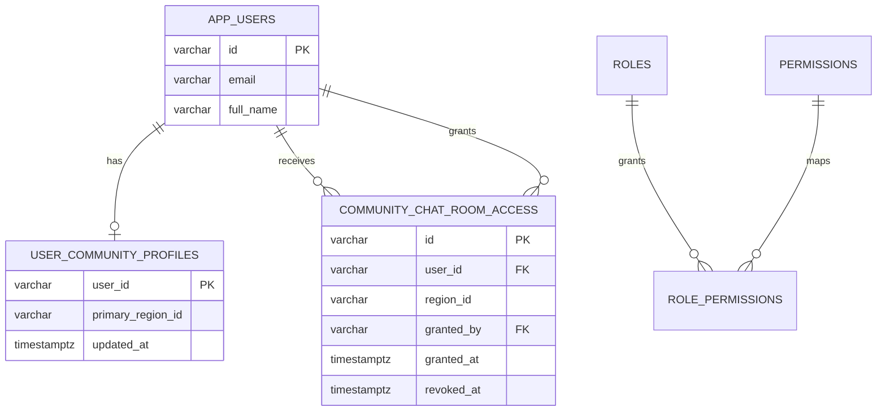

# Cambios de base de datos - Chat comunitario SDD

Fecha: 2026-05-28  
Migracion principal: `Producto/backend/simfat-backend/src/main/resources/db/migration/V3__community_chat_access_foundation.sql`

## Resumen

El chat comunitario agrega datos relacionales para gobernar acceso regional y documentos MongoDB para mensajeria operativa. La identidad sigue centralizada en `app_users` y la verificacion en el modelo RBAC/verificacion existente.

## PostgreSQL / Supabase

### Nuevas tablas

| Tabla | Proposito |
|---|---|
| `user_community_profiles` | Guarda region primaria comunitaria del usuario. |
| `community_chat_room_access` | Guarda grants adicionales de acceso a subsalas regionales. |

### `user_community_profiles`

| Columna | Tipo | Regla |
|---|---|---|
| `user_id` | `VARCHAR(36)` | PK y FK a `app_users(id)`, cascade delete. |
| `primary_region_id` | `VARCHAR(80)` | Region comunitaria principal. |
| `updated_at` | `TIMESTAMPTZ` | Fecha de actualizacion. |

Indices:

- `idx_user_community_profiles_region(primary_region_id)`

### `community_chat_room_access`

| Columna | Tipo | Regla |
|---|---|---|
| `id` | `VARCHAR(36)` | PK. |
| `user_id` | `VARCHAR(36)` | FK a `app_users(id)`, cascade delete. |
| `region_id` | `VARCHAR(80)` | Region adicional habilitada. |
| `granted_by` | `VARCHAR(36)` | FK opcional a `app_users(id)`. |
| `granted_at` | `TIMESTAMPTZ` | Fecha de grant. |
| `revoked_at` | `TIMESTAMPTZ` | Null si el grant esta activo. |

Indices:

- `idx_community_chat_room_access_user(user_id)`
- `idx_community_chat_room_access_region(region_id)`
- `idx_community_chat_room_access_active(user_id, region_id, revoked_at)`

### Nuevos permisos

| Permiso | Modulo | Uso |
|---|---|---|
| `PERM_COMMUNITY_CHAT_READ` | `community_chat` | Consultar salas y mensajes. |
| `PERM_COMMUNITY_CHAT_SEND` | `community_chat` | Enviar mensajes. |
| `PERM_COMMUNITY_CHAT_MODERATE` | `community_chat` | Moderar mensajes. |
| `PERM_COMMUNITY_CHAT_ACCESS_MANAGE` | `community_chat` | Gestionar grants regionales. |

### Asignacion por rol

| Rol | Permisos chat |
|---|---|
| `ROLE_COMMUNITY_USER` | read, send |
| `ROLE_VERIFIED_USER` | read, send |
| `ROLE_MODERATOR` | read, send, moderate |
| `ROLE_ADMIN` | read, send, moderate, access_manage |
| `ROLE_SUPER_ADMIN` | todos los permisos `community_chat` |

## MongoDB

### Nuevas colecciones logicas

| Coleccion | Modelo Java | Proposito |
|---|---|---|
| `community_chat_rooms` | `CommunityChatRoom` | Sala general y subsalas regionales. |
| `community_chat_messages` | `CommunityChatMessage` | Mensajes del chat. |
| `community_chat_presence` | `CommunityChatPresence` | Estado de presencia por usuario/sala. |
| `community_chat_moderation_events` | `CommunityChatModerationEvent` | Auditoria de moderacion. |

### Retencion

| Condicion operacional | Politica |
|---|---|
| Menos de 6 regiones activas | Mantener mensajes 6 meses. |
| 6 o mas regiones activas | Mantener mensajes 1 mes. |

La regla busca controlar costo operativo y volumen de almacenamiento si el piloto escala.

## Diagrama MER resumido

## Rollback conceptual

En entornos no productivos, el rollback implica retirar grants `community_chat`, eliminar las tablas relacionales nuevas y limpiar colecciones MongoDB del chat. En produccion, debe evaluarse respaldo previo por contener auditoria y trazabilidad operativa.
