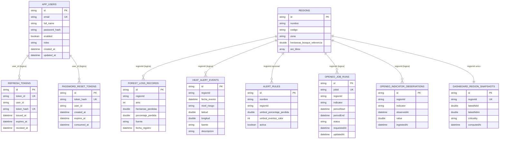

# MER Actualizado - SIMFAT Backend

Fecha: 2026-04-22  
Version: 1.0

## Objetivo

Representar el modelo entidad-relacion/l?gico actualizado considerando estructuras activas en:

- PostgreSQL (auth)
- MongoDB (dominio territorial y analitica)

## MER (Mermaid)

## Nota DUOC

Las relaciones marcadas como "l?gica" son gestionadas por aplicacion (sin FK fisica en Mongo ni FK SQL expl?cita en auth).
