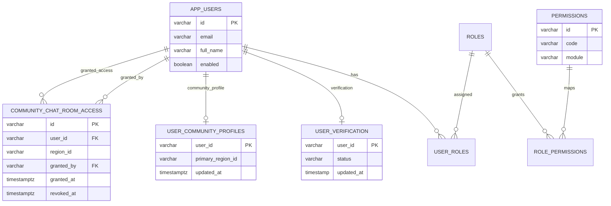
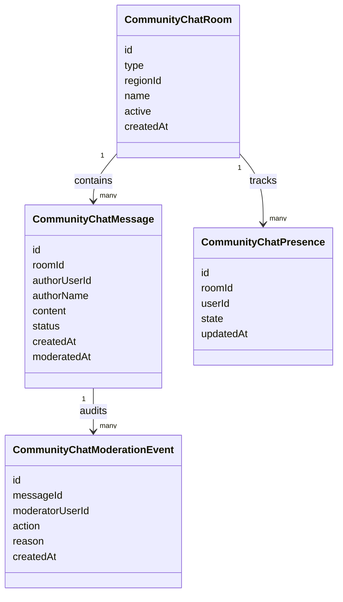

# MER Chat Comunitario SDD

Fecha: 2026-05-28  
Alcance: modelo de datos agregado para chat comunitario territorial.

## Vista integrada

## MongoDB operativo

## Reglas de integridad

- `user_community_profiles.user_id` depende de `app_users.id`.
- `community_chat_room_access.user_id` depende de `app_users.id`.
- `community_chat_room_access.granted_by` permite trazabilidad del administrador que otorgo acceso.
- `revoked_at IS NULL` representa grant activo.
- Mensajes y presencia referencian usuarios por `userId` para trazabilidad cruzada entre MongoDB y PostgreSQL.
