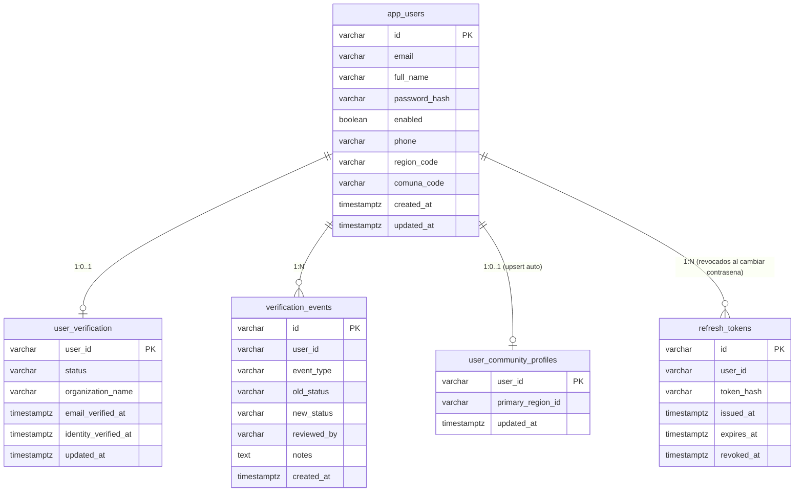

# MER — Gestion de Cuenta y Perfil de Usuario

Fecha: 2026-06-05
Sprint: CU12 / CU13 / CU14 — Gestion de Cuenta y Perfil
Estado: implementado en produccion

---

## 1. Cambios en PostgreSQL

### 1.1 Tabla app_users — campos agregados

Este sprint agrego tres columnas a la tabla existente `app_users` mediante dos migraciones Flyway:

**Diagrama relacional (campos nuevos resaltados):**

```
app_users
┌─────────────────────────────────────────────────────────┐
│ id              VARCHAR(36)  PK                          │
│ email           VARCHAR(180) NOT NULL UNIQUE             │
│ full_name       VARCHAR(120) NOT NULL                    │
│ password_hash   VARCHAR(100) NOT NULL                    │
│ enabled         BOOLEAN      NOT NULL DEFAULT TRUE       │
│ roles           VARCHAR(255) NOT NULL                    │
│ *** phone       VARCHAR(20)  NULL  ← nuevo V4           │
│ *** region_code VARCHAR(20)  NULL  ← nuevo V4/V5        │
│ *** comuna_code VARCHAR(20)  NULL  ← nuevo V4/V5        │
│ created_at      TIMESTAMPTZ  NOT NULL                    │
│ updated_at      TIMESTAMPTZ  NOT NULL                    │
└─────────────────────────────────────────────────────────┘
```

| Columna | Tipo | Restricciones | Descripcion |
|---|---|---|---|
| phone | VARCHAR(20) | NULL | Telefono de contacto. Texto libre sin validacion de formato |
| region_code | VARCHAR(20) | NULL | ID de region del piloto: "biobio", "nuble" o "araucania" |
| comuna_code | VARCHAR(20) | NULL | GADM GID Level 3 — ej. "CHL.6.3.2_1" (hasta 13 chars) |

**Por que VARCHAR(20):** los IDs GADM Level 3 tienen formato "CHL.{d}.{d}.{d}_{d}" que puede alcanzar 13 caracteres. VARCHAR(10) original fue insuficiente — se expandio en V5.

### 1.2 Migraciones aplicadas

```sql
-- V4__add_user_profile_fields.sql
ALTER TABLE app_users
    ADD COLUMN phone       VARCHAR(20),
    ADD COLUMN region_code VARCHAR(10),
    ADD COLUMN comuna_code VARCHAR(10);

-- V5__expand_user_profile_codes.sql
ALTER TABLE app_users
    ALTER COLUMN region_code TYPE VARCHAR(20),
    ALTER COLUMN comuna_code TYPE VARCHAR(20);
```

---

## 2. Tabla user_community_profiles — sin cambio de schema, logica nueva

El schema existente no cambio. Lo que si cambio es el **mecanismo de escritura**:

```
user_community_profiles
┌─────────────────────────────────────────────────────────┐
│ user_id          VARCHAR(36)  PK FK → app_users         │
│ primary_region_id VARCHAR(80) NULL                      │
│ updated_at       TIMESTAMPTZ  NOT NULL (@PreUpdate)     │
└─────────────────────────────────────────────────────────┘
```

**Comportamiento nuevo:** cuando el usuario guarda su `region_code` via `PATCH /api/account/me`, el servicio hace **upsert automatico** de `primary_region_id` con el mismo valor. Esto otorga acceso al chat regional sin intervencion del admin.

Flujo:
```
usuario guarda regionCode="biobio"
    ↓
AccountServiceImpl.updateProfile()
    ↓ upsert
user_community_profiles.primary_region_id = "biobio"
    ↓
ChatService.canAccessRoom("biobio") → true
```

Los valores de `region_code` / `primary_region_id` son identicos (`"biobio"`, `"nuble"`, `"araucania"`) porque los selects del frontend usan los mismos IDs que las salas de chat.

---

## 3. Tabla verification_events — sin cambio de schema, nuevo tipo de evento

El campo `event_type` es VARCHAR. Se persiste el nuevo literal `"IDENTITY_RESET"` cuando el usuario cambia su `full_name` y tenia verificacion IDENTITY_VERIFIED o FULLY_VERIFIED.

```
verification_events
┌─────────────────────────────────────────────────────────┐
│ id          VARCHAR(36)  PK                              │
│ user_id     VARCHAR(36)  FK → app_users                 │
│ event_type  VARCHAR(80)  NOT NULL  ← "IDENTITY_RESET"  │
│ old_status  VARCHAR(40)  NULL                           │
│ new_status  VARCHAR(40)  NULL                           │
│ reviewed_by VARCHAR(36)  FK → app_users (= user mismo) │
│ notes       TEXT         NULL                           │
│ created_at  TIMESTAMPTZ  NOT NULL                       │
└─────────────────────────────────────────────────────────┘
```

Ejemplo de registro generado:
```json
{
  "event_type": "IDENTITY_RESET",
  "old_status": "FULLY_VERIFIED",
  "new_status": "EMAIL_VERIFIED",
  "reviewed_by": "<userId>",
  "notes": "Nombre cambiado por el propio usuario"
}
```

---

## 4. Nuevos DTOs Java — no son tablas pero forman parte del modelo de datos

| DTO | Uso | Campos clave |
|---|---|---|
| `AccountProfileDTO` | Respuesta GET y PATCH /api/account/me | id, email, fullName, phone, regionCode, comunaCode, organizationName, verificationStatus, roles, createdAt |
| `UpdateProfileRequestDTO` | Body PATCH /api/account/me | fullName (@Size 1-120), phone (@Size 0-20), regionCode (@Size 0-20), comunaCode (@Size 0-20) |
| `ChangePasswordRequestDTO` | Body POST /api/account/change-password | currentPassword (@NotBlank), newPassword (@Pattern), confirmPassword (@NotBlank) |

---

## 5. Extension AccessUserDTO — panel admin

Cuatro campos agregados al DTO existente:

| Campo nuevo | Fuente de datos |
|---|---|
| phone | app_users.phone |
| regionCode | app_users.region_code |
| comunaCode | app_users.comuna_code |
| organizationName | user_verification.organization_name |

---

## 6. Diagrama de relaciones del sprint



---

## 7. Notas de integridad

- `phone`, `region_code`, `comuna_code` son nullable. Usuarios existentes no necesitan backfill.
- No hay FK de `region_code` a una tabla de regiones — la coherencia la enforcea el select del frontend con datos de `territorioChile.js`.
- `user_community_profiles.primary_region_id` tampoco tiene FK fisica a la coleccion MongoDB `regions` — referencia logica por convenio de IDs.
- Al revocar tokens en `change-password`, solo se afectan filas con `revoked_at IS NULL` del usuario. No se eliminan filas.
