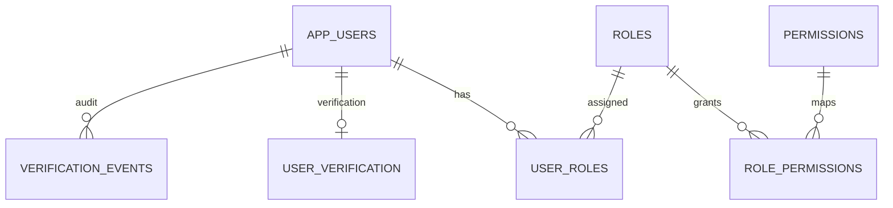
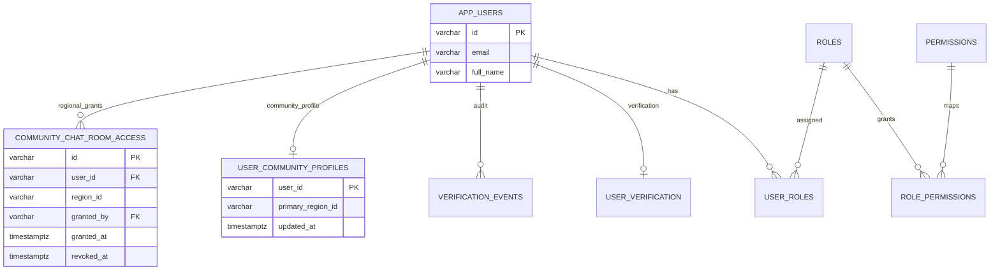

# MER Integrado Semana 10 - PostgreSQL + MongoDB + RBAC

Fecha: 2026-05-15

## Entidades relacionales principales (PostgreSQL)

- `app_users`
- `roles`
- `permissions`
- `user_roles`
- `role_permissions`
- `user_verification`
- `verification_events`

## Relacional (resumen)

## Colecciones/documentos operativos (MongoDB)

- `heat_alert_events`
- `forest_loss_records`
- `community_board_posts`
- `community_resources`
- `citizen_reports`
- `open_eo_job_runs`
- `open_eo_indicator_observations`

## Decisiones

- RBAC y verificacion se gobiernan en PostgreSQL para integridad y joins de seguridad.
- Datos operativos y de series/telemetria se mantienen en MongoDB por flexibilidad y volumen.
- Las claves de usuario (`user_id`) permiten trazabilidad cruzada entre ambos motores.

---

# Actualizacion 2026-05-28 - Chat comunitario SDD

## Nuevas entidades relacionales

- `user_community_profiles`
- `community_chat_room_access`

## Nuevas colecciones MongoDB

- `community_chat_rooms`
- `community_chat_messages`
- `community_chat_presence`
- `community_chat_moderation_events`

## Diagrama integrado actualizado

## Decision

La identidad y autorizacion del chat quedan en PostgreSQL/RBAC; los mensajes, presencia y auditoria operativa se guardan en MongoDB por flexibilidad y bajo acoplamiento con el modelo transaccional.
