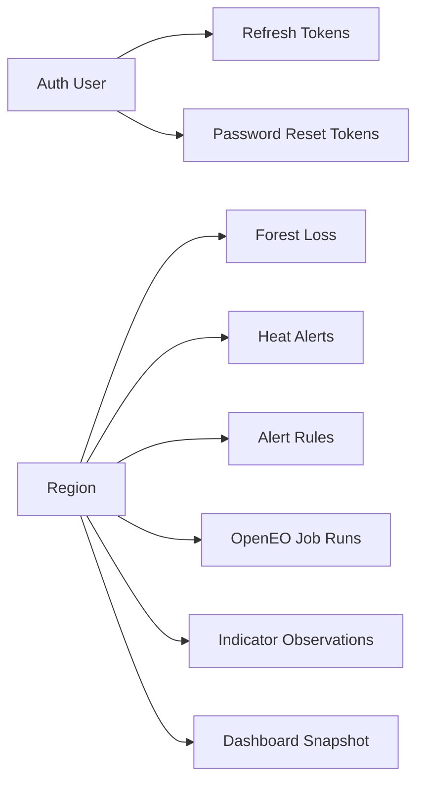

# Modelo Logico de Actualizacion - SIMFAT

Fecha: 2026-04-22  
Version: 1.0

## 1) Contexto

La actualizacion integra tres lineas:

1. Fortalecimiento auth (PostgreSQL)
2. Consolidacion dominio territorial (MongoDB)
3. Integraci?n satelital y snapshot para dashboard (MongoDB + servicios)

## 2) L?gica funcional por m?dulo

### 2.1 Auth y seguridad

- Registro/login emiten access token + refresh token.
- Refresh token se rota y revoca.
- Reset de password usa token hash con expiracion y consumo unico.

### 2.2 Dominio territorial

- `regions` actua como nodo raiz territorial.
- `forest_loss_records`, `heat_alert_events` y `alert_rules` referencian region.
- Las reglas pueden ser globales (`regionId = null`) o especificas.

### 2.3 Analitica satelital

- `openeo_job_runs`: trazabilidad de ejecuci?n de sincronizaciones.
- `openeo_indicator_observations`: serie hist?rica NDVI/NDMI por region.
- `dashboard_region_snapshots`: estado agregado listo para respuesta r?pida.

## 3) Modelo l?gico (vista resumida)

## 4) Estructuras nuevas/proyectadas de iteraci?n frontend

Para la iteraci?n territorial-comunitaria, el contrato backend debe incorporar:

- `community_board`
- `community_resources`
- `community_contacts`
- `citizen_reports`

Estado actual: contrato documentado y frontend preparado, pendiente implementacion backend.

## 5) Reglas de consistencia

1. `regionId` debe existir en `regions` para todo dato territorial.
2. `openeo_indicator_observations` mantiene unicidad l?gica por:
   - `regionId + indicator + observedAt`
3. `dashboard_region_snapshots` mantiene una fila vigente por region.
4. Tokens auth nunca se guardan en texto plano (solo hash).
