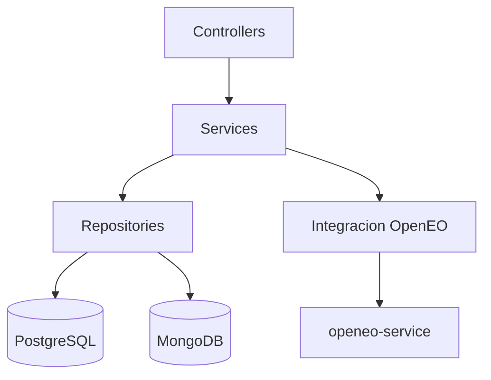

# Diagrama de Arquitectura Actualizada - SIMFAT

Fecha: 2026-04-22  
Version: 1.0  
Repositorio: `simfat-backend/docs/Documentacion/Diagramas`

## Objetivo

Documentar la arquitectura actualizada de la solucion SIMFAT considerando:

- `simfat-web` como cliente principal
- `simfat-backend` como API y orquestador de negocio
- `openeo-service` como integraci?n satelital
- persistencia hibrida PostgreSQL + MongoDB

## Diagrama (Mermaid)

```mermaid
flowchart LR
    U[Usuario / Actor territorial] --> W[simfat-web\nReact + Vite]

    W -->|JWT + REST| B[simfat-backend\nSpring Boot]
    B -->|Indicadores y jobs| O[openeo-service\nFastAPI]
    O -->|OpenEO/CDSE| E[Proveedor satelital externo]

    B --> P[(PostgreSQL)\nAuth y tokens]
    B --> M[(MongoDB)\nDominio territorial + snapshots]

    B -->|Endpoints dashboard| W
    B -->|Endpoints comunidad/reportes| W
```

## Capas internas relevantes de simfat-backend



## Notas de arquitectura

1. El frontend no se conecta directo a `openeo-service`; todo pasa por backend.
2. El backend concentra normalizacion y cache de consultas para reducir costo de API externa.
3. El modelo de datos se divide en:
   - Relacional (auth y seguridad de sesi?n)
   - Documental (dominio territorial y analitica)
