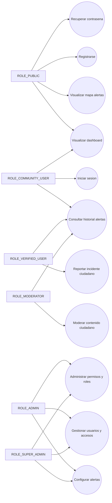

# UML Casos de Uso - Semana 10 (Roles RBAC Ampliados)

Fecha: 2026-05-15

## Actores

- `ROLE_PUBLIC`
- `ROLE_COMMUNITY_USER`
- `ROLE_VERIFIED_USER`
- `ROLE_MODERATOR`
- `ROLE_ADMIN`
- `ROLE_SUPER_ADMIN`

## Diagrama de casos de uso (mermaid)

## Notas

- La jerarquia funcional es acumulativa por permisos efectivos.
- `ROLE_VERIFIED_USER` agrega capacidades de reporte y geolocalizacion por sobre comunidad.
- `ROLE_ADMIN` y `ROLE_SUPER_ADMIN` concentran operaciones sensibles y de gobierno.
