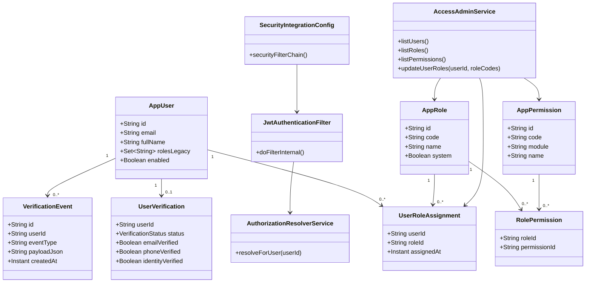

# UML Clases - Seguridad RBAC/JWT (Semana 10)

Fecha: 2026-05-15

## Resumen

- El modelo separa autenticacion (JWT) de autorizacion (RBAC en BD).
- Los permisos no quedan hardcodeados en el frontend ni en el token.
- Queda preparado para evolucionar a trust score y auditoria avanzada.
