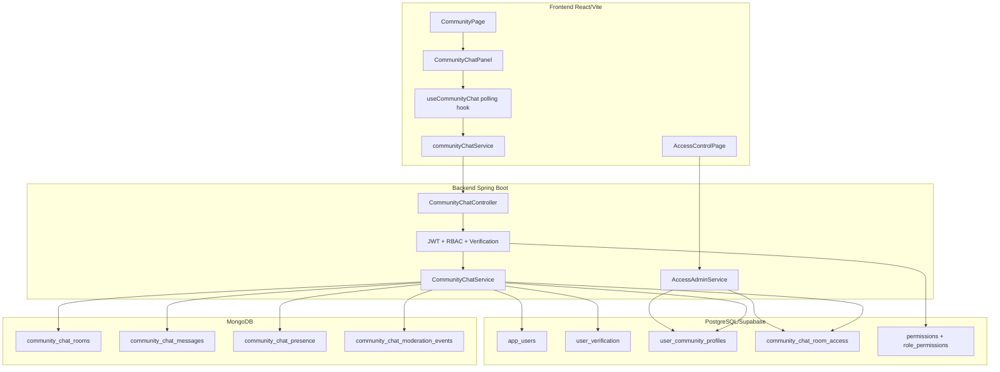
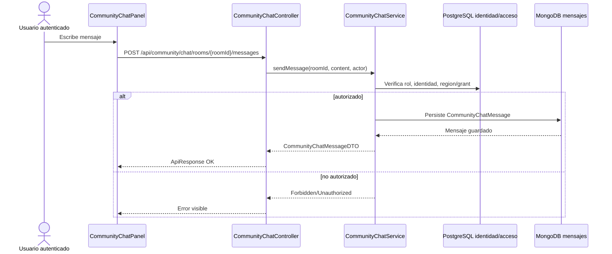
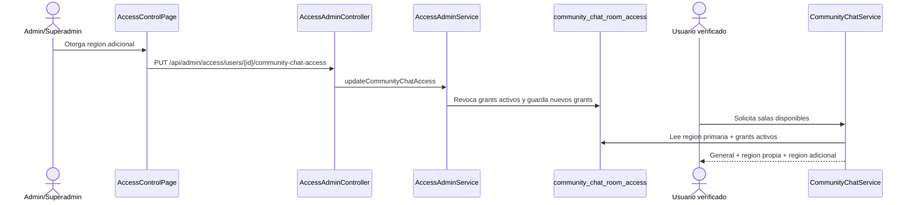

# Arquitectura Chat Comunitario SDD

Fecha: 2026-05-28  
Modulo propietario: Comunitario

## Diagrama de componentes

## Flujo de envio de mensaje

## Flujo de acceso regional cruzado

## Decision de realtime

El MVP usa polling para reducir complejidad y costo inicial. WebSocket/SSE queda como fase posterior si el volumen de usuarios conectados o la criticidad operativa lo justifican.
