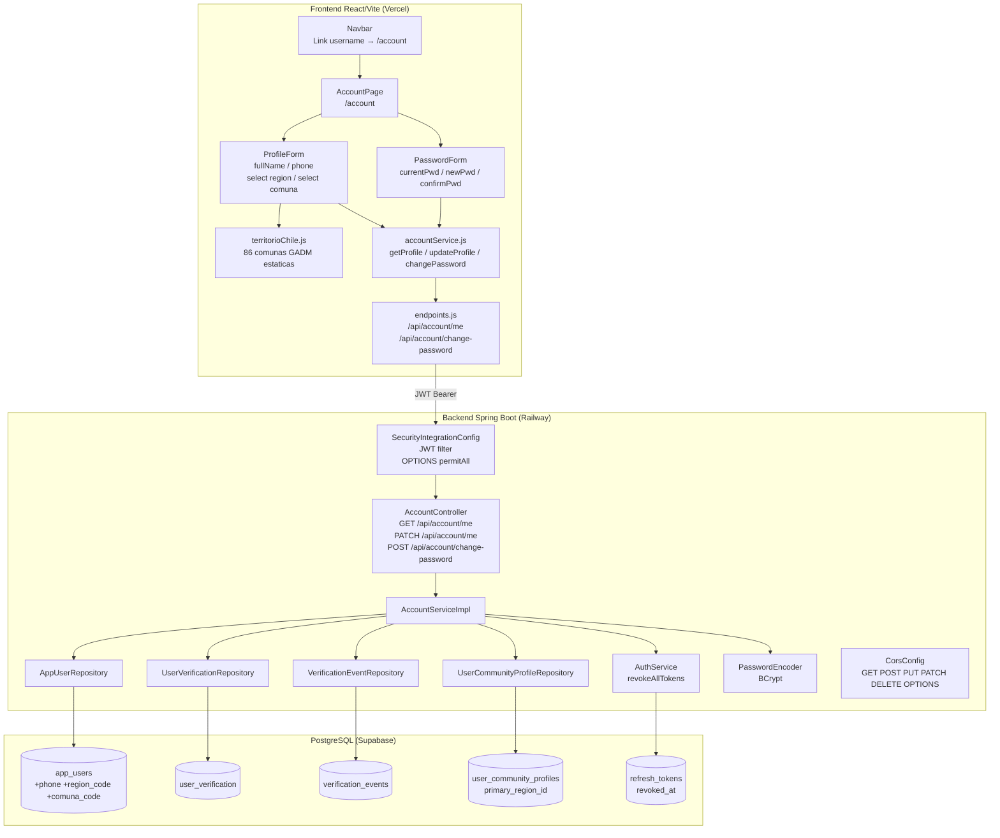
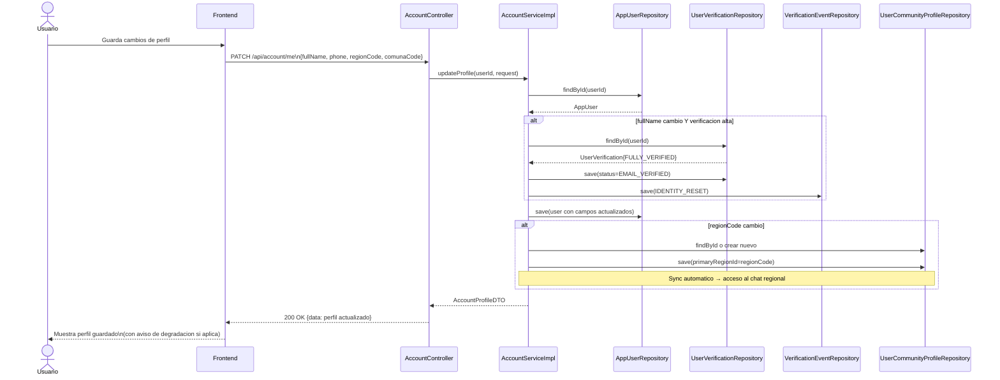
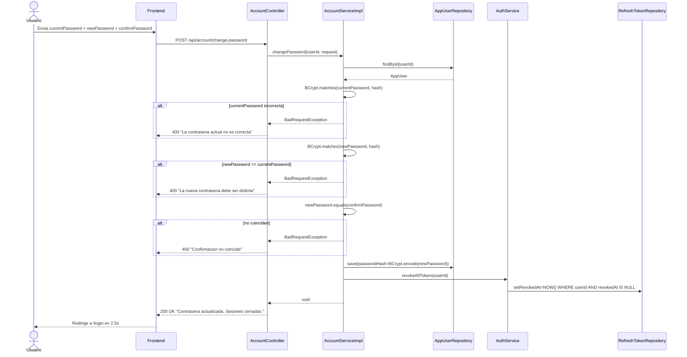

# Arquitectura — Gestion de Cuenta y Perfil de Usuario

Fecha: 2026-06-05
Sprint: CU12 / CU13 / CU14
Estado: implementado en produccion

---

## 1. Diagrama de componentes



---

## 2. Diagrama de clases

```mermaid
classDiagram
    class AccountController {
        +getProfile(principal) AccountProfileDTO
        +updateProfile(principal, UpdateProfileRequestDTO) AccountProfileDTO
        +changePassword(principal, ChangePasswordRequestDTO) void
    }

    class AccountService {
        <<interface>>
        +getProfile(userId) AccountProfileDTO
        +updateProfile(userId, UpdateProfileRequestDTO) AccountProfileDTO
        +changePassword(userId, ChangePasswordRequestDTO) void
    }

    class AccountServiceImpl {
        -appUserRepository AppUserRepository
        -userVerificationRepository UserVerificationRepository
        -verificationEventRepository VerificationEventRepository
        -userCommunityProfileRepository UserCommunityProfileRepository
        -passwordEncoder PasswordEncoder
        -authService AuthService
        +getProfile(userId) AccountProfileDTO
        +updateProfile(userId, request) AccountProfileDTO
        +changePassword(userId, request) void
        -requireUser(userId) AppUser
        -toProfileDTO(user, verification) AccountProfileDTO
    }

    class AuthService {
        <<interface>>
        +revokeAllTokens(userId) void
    }

    class AppUser {
        +String id
        +String email
        +String fullName
        +String passwordHash
        +Boolean enabled
        +Set~AppRole~ rolesLegacy
        +String phone
        +String regionCode
        +String comunaCode
        +Instant createdAt
        +Instant updatedAt
    }

    class UserVerification {
        +String userId
        +VerificationStatus status
        +String organizationName
        +Instant emailVerifiedAt
        +Instant identityVerifiedAt
    }

    class VerificationEvent {
        +String id
        +String userId
        +String eventType
        +VerificationStatus oldStatus
        +VerificationStatus newStatus
        +String reviewedBy
        +String notes
        +Instant createdAt
    }

    class UserCommunityProfile {
        +String userId
        +String primaryRegionId
        +Instant updatedAt
    }

    class AccountProfileDTO {
        +String id
        +String email
        +String fullName
        +String phone
        +String regionCode
        +String comunaCode
        +String organizationName
        +String verificationStatus
        +Set~String~ roles
        +Instant createdAt
    }

    class UpdateProfileRequestDTO {
        +String fullName
        +String phone
        +String regionCode
        +String comunaCode
    }

    class ChangePasswordRequestDTO {
        +String currentPassword
        +String newPassword
        +String confirmPassword
    }

    AccountController --> AccountService
    AccountServiceImpl ..|> AccountService
    AccountServiceImpl --> AppUser
    AccountServiceImpl --> UserVerification
    AccountServiceImpl --> VerificationEvent
    AccountServiceImpl --> UserCommunityProfile
    AccountServiceImpl --> AuthService
    AccountController ..> AccountProfileDTO
    AccountController ..> UpdateProfileRequestDTO
    AccountController ..> ChangePasswordRequestDTO
```



---

## 3. Diagrama de secuencia — PATCH /api/account/me



---

## 4. Diagrama de secuencia — POST /api/account/change-password



---

## 5. Flujo de datos frontend — selects de region/comuna

```mermaid
flowchart LR
    subgraph territorioChile.js
        R[REGIONES\nbiobio / nuble / araucania]
        C[getComunasByRegion\nregionId → ComunaInfo[]]
    end

    subgraph AccountPage.jsx
        SR[select region\nonChange resetComuna]
        SC[select comuna\nfiltrado por regionSeleccionada]
        BT[Guardar perfil]
    end

    subgraph accountService.js
        UP[updateAccountProfile\nPATCH /api/account/me]
    end

    R --> SR
    SR -->|regionId| C
    C --> SC
    SC --> BT
    BT --> UP
```

**Valores en el select de region:**

| value | label |
|---|---|
| `"biobio"` | Biobío |
| `"nuble"` | Ñuble |
| `"araucania"` | Araucanía |

Los valores coinciden exactamente con `regions._id` en MongoDB y con `community_chat_room_access.region_id`, habilitando el sync automatico sin transformacion.

---

## 6. Integracion con modulo de chat — sync de region

```mermaid
flowchart TD
    A[Usuario guarda regionCode="biobio"] --> B[AccountServiceImpl.updateProfile]
    B --> C{regionCode != null?}
    C -->|si| D[upsert UserCommunityProfile\nprimaryRegionId = regionCode]
    D --> E[ChatService.canAccessRoom]
    E --> F{primaryRegionId\n== roomRegionId?}
    F -->|si| G[Acceso al chat regional habilitado]
    F -->|no| H[Sin acceso al chat]
    C -->|no| I[No se modifica primaryRegionId]
```

El admin puede sobrescribir `primary_region_id` desde el panel de administracion para revocar o cambiar el acceso, independientemente de lo que el usuario tenga en su perfil.

---

## 7. Seguridad — cambios en configuracion

### CorsConfig.java
```java
registry.addMapping("/api/**")
    .allowedMethods("GET", "POST", "PUT", "PATCH", "DELETE", "OPTIONS")
    // PATCH agregado en este sprint para soportar PATCH /api/account/me
```

### SecurityIntegrationConfig.java
```java
.authorizeHttpRequests(auth -> auth
    .requestMatchers(HttpMethod.OPTIONS, "/**").permitAll()  // primera regla — preflight CORS
    // ... otras reglas ...
    .requestMatchers("/api/account/**").authenticated()      // cualquier usuario autenticado
)
```

La regla OPTIONS debe ser la primera para que el filtro CORS pueda procesar el preflight antes de que Spring Security evalúe autenticacion.
