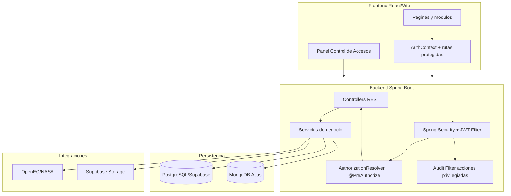
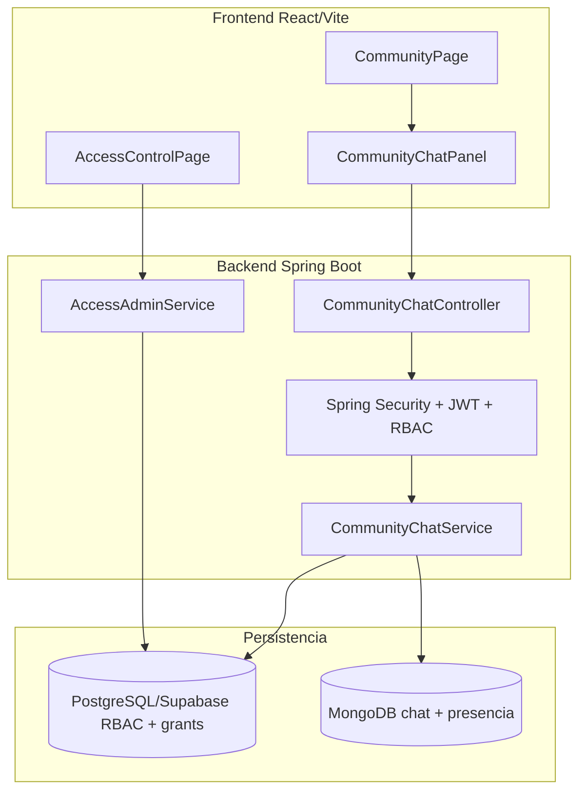

# Arquitectura Integrada SIMFAT - Semana 10

Fecha: 2026-05-15

## Diagrama de arquitectura (capas y flujo)

## Flujo de seguridad

1. El usuario autentica y obtiene JWT.
2. Cada request protegido pasa por `JwtAuthenticationFilter`.
3. El backend resuelve roles/permisos efectivos desde BD.
4. `@PreAuthorize` aplica minimo privilegio en endpoints criticos.
5. Acciones privilegiadas mutantes se registran en auditoria.

---

# Actualizacion 2026-05-28 - Arquitectura chat comunitario

El chat se mantiene en el modulo comunitario. Territorio/region opera como contexto de sala y control de acceso, no como ownership del modulo.
