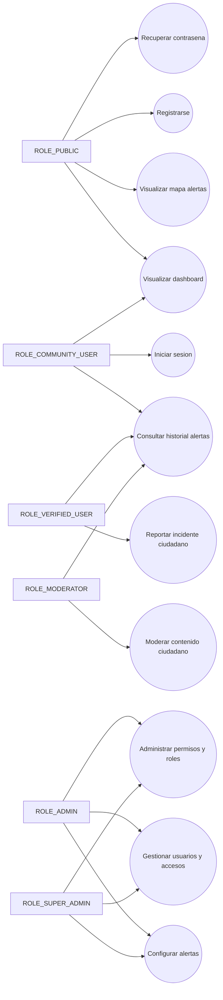
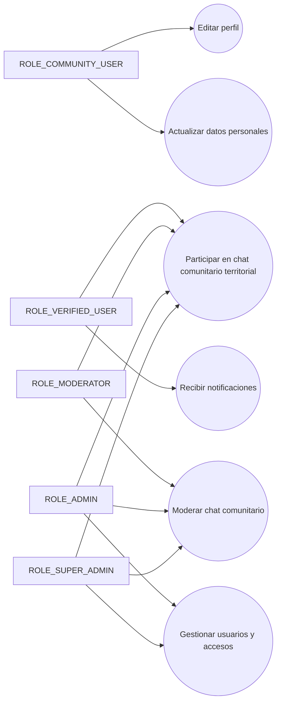

# UML Casos de Uso - Semana 10 (Roles RBAC Ampliados)

Fecha: 2026-05-15

## Actores

- `ROLE_PUBLIC`
- `ROLE_COMMUNITY_USER`
- `ROLE_VERIFIED_USER`
- `ROLE_MODERATOR`
- `ROLE_ADMIN`
- `ROLE_SUPER_ADMIN`

## Diagrama de casos de uso (mermaid)

## Notas

- La jerarquia funcional es acumulativa por permisos efectivos.
- `ROLE_VERIFIED_USER` agrega capacidades de reporte y geolocalizacion por sobre comunidad.
- `ROLE_ADMIN` y `ROLE_SUPER_ADMIN` concentran operaciones sensibles y de gobierno.

---

# Actualizacion 2026-05-28 - Casos de uso chat comunitario

## Casos agregados o extendidos

- `CU09`: recibir notificaciones; el chat puede generar avisos como fase posterior.
- `CU12`: editar perfil; la identidad visible del chat depende del perfil/verificacion.
- `CU14`: actualizar datos personales; nombre/apellido verificado se reutiliza como autor visible.
- `CU15`: gestionar usuarios y accesos; agrega region primaria y grants regionales de chat.
- `CUX4`: participar en chat comunitario territorial.
- `CUX5`: moderar chat comunitario.

## Diagrama actualizado

## Reglas

- Usuarios comunitarios deben estar verificados para participar.
- Moderadores, administradores y superadministradores pueden entrar a todas las salas.
- El control inicial de moderacion se apoya en identidad verificada por falta de personal operativo dedicado.
